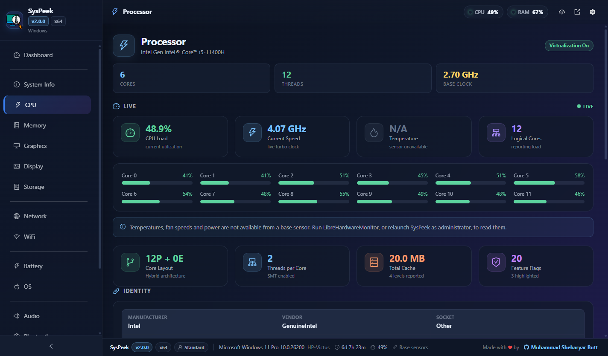
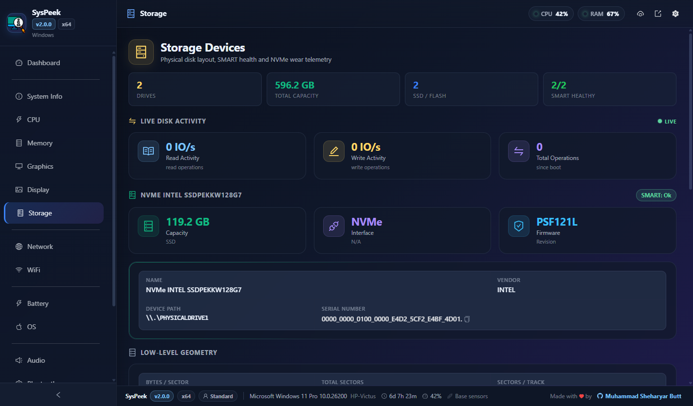
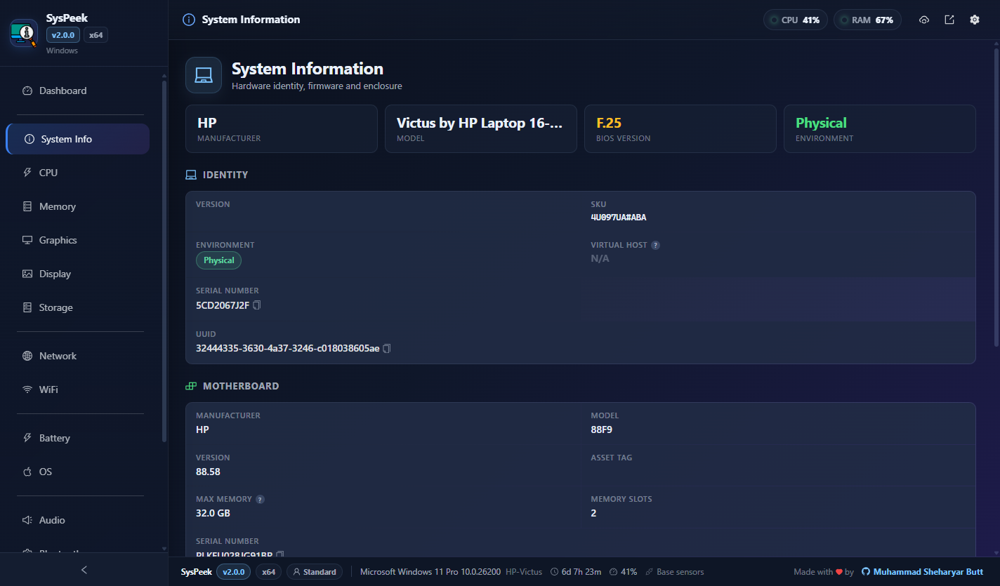
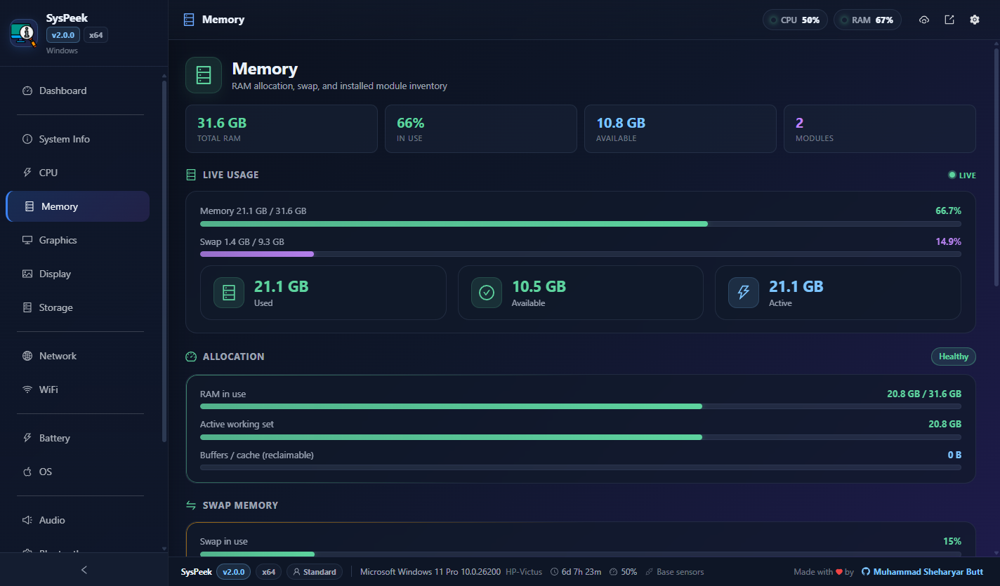

<div align="center">
  <a href="https://choosealicense.com/licenses/mit/">
    
  </a>
  
  
  
  
</div>

<br/>

<div align="center">
  
</div>

# SysPeek System Information Viewer

SysPeek is a modern, secure, cross platform desktop app for inspecting and monitoring your machine in one place. Version 2 is a full rewrite of the tooling and architecture: a Vite powered build, a hardened Electron process model, live streaming telemetry, and automatic updates delivered through GitHub releases.

## What is new in v2.0.0

Version 2 keeps the glassmorphism dashboard people liked and rebuilds everything under it.

- **New build system.** Create React App is replaced by [electron-vite](https://electron-vite.org/), giving instant hot reload for both the UI and the main process.
- **Hardened security model.** The renderer no longer touches Node. `systeminformation` runs only in the main process, and the UI talks to it through a locked down, context isolated, sandboxed preload bridge.
- **Full TypeScript.** The main process, the preload bridge, and every React component are typed, with a single shared IPC contract.
- **Automatic updates.** Built in updater backed by GitHub releases, with an in app "download and restart" flow and a verified release process that checks every installer against its update manifest before publishing.
- **Live history charts, a system tray, threshold notifications, a settings panel, theme and accent options, report export, and opt in elevated access.**
- **Latest dependencies.** Electron 43, React 19, Ant Design 6, systeminformation 5, Vite 7, TypeScript 6.

## Tech Stack

| Layer | Technology |
| --- | --- |
| Desktop shell | Electron 43 |
| Build tooling | electron-vite 5, Vite 7 |
| UI | React 19, Ant Design 6, uPlot |
| Language | TypeScript 6 |
| System data | [systeminformation](https://systeminformation.io/) 5 |
| Packaging and updates | electron-builder 26, electron-updater 6 |
| Settings storage | electron-store |

## Features

- Live Task Manager style dashboard: CPU, memory, disk I/O, network, uptime, per core load, and streaming history charts
- Detailed pages for System, CPU, Memory, Graphics, Display, Storage, Network, WiFi, Battery, OS, Audio, Bluetooth, Printers, and USB
- Process explorer with search, sorting, and resource usage
- System tray with live CPU and memory readout, plus quick actions
- Desktop notifications when CPU temperature, CPU load, memory, or disk usage cross configurable thresholds
- Settings panel: theme (dark or light), accent color, refresh interval, tray behavior, launch at startup, and alert thresholds
- Export a full JSON report of the machine at any time
- Automatic updates from GitHub releases with an in app restart prompt
- Optional "Relaunch as Administrator" on Windows to expose sensor data that requires elevation
- Window position and size are remembered between sessions

## Screenshots

<div align="center">
  
  <br>
  <em>Live dashboard with system pulse, KPI row, and streaming history charts</em>
</div>

<br/>

<div align="center">
  <table>
    <tr>
      <td align="center" width="50%">
        
        <br>
        <em>Processor: topology, clocks, cache, and parsed instruction sets</em>
      </td>
      <td align="center" width="50%">
        
        <br>
        <em>Storage: SMART health and NVMe wear telemetry</em>
      </td>
    </tr>
    <tr>
      <td align="center" width="50%">
        
        <br>
        <em>System: identity, BIOS features, motherboard, and chassis</em>
      </td>
      <td align="center" width="50%">
        
        <br>
        <em>Memory: usage breakdown and per-module details</em>
      </td>
    </tr>
  </table>
</div>

## Getting Started

Prerequisites: Node 20.19 or newer (Node 22 recommended) and npm.

```bash
git clone https://github.com/shehari007/SysPeek-hwinfo-react-electron-app.git
cd SysPeek-hwinfo-react-electron-app
npm install
npm run dev
```

`npm run dev` launches the app in Electron with hot reload for both the renderer and the main process.

### Useful scripts

| Script | Purpose |
| --- | --- |
| `npm run dev` | Start the app in development with hot reload |
| `npm run build` | Type check and bundle main, preload, and renderer into `out/` |
| `npm run typecheck` | Run the TypeScript compiler across both project references |
| `npm run lint` | Lint the codebase with ESLint 10 flat config |
| `npm run format` | Format the codebase with Prettier |
| `npm run build:win` | Build a Windows NSIS installer |
| `npm run build:mac` | Build a macOS dmg and zip |
| `npm run build:linux` | Build a Linux AppImage and deb |

## Building installers

Installers are produced by electron-builder and land in the `release/` folder.

```bash
npm run build:win     # Windows installer (.exe)
npm run build:linux   # Linux AppImage and .deb
npm run build:mac     # macOS .dmg and .zip
```

## Automatic updates

SysPeek ships with `electron-updater` wired to GitHub releases. Publishing an update is three steps:

1. Bump `version` in `package.json`.
2. Run `npm run release:win`. This packages the installer and verifies the generated `latest.yml`, recomputing each sha512 and size against the files on disk.
3. Attach the installer, its `.blockmap` and `latest.yml` to a GitHub release, then publish it.

`latest.yml` is the whole feed. It carries the version and the sha512 of each installer, and clients refuse an update whose hash does not match, so the installer and the manifest must come from the same build.

Installed clients check for updates on launch, download in the background, and offer a "Restart and Install" prompt. macOS is the exception: it detects updates but links out to the releases page instead, because installing one requires an Apple Developer ID signature.

[RELEASE.md](RELEASE.md) is the full checklist. See [docs/AUTO_UPDATE.md](docs/AUTO_UPDATE.md) for signing notes and the mechanism underneath.

## Security model

SysPeek follows the Electron security checklist. See [SECURITY.md](SECURITY.md) for details.

- `contextIsolation` is on, `sandbox` is on, and `nodeIntegration` is off.
- The renderer never imports Node modules. All privileged work happens in the main process.
- The renderer talks to the main process only through a small, explicitly whitelisted preload bridge (one function per capability, no generic passthrough).
- Incoming IPC is validated against the main window before it is handled.
- A strict Content Security Policy is applied, and navigation and new window creation are locked down.

## Project structure

```text
src/
  main/        Electron main process (windows, IPC, tray, updater, polling)
  preload/     Context bridge exposing a typed, whitelisted API
  shared/      IPC channel names and shared TypeScript types
  renderer/    React UI (Vite root)
    src/
      Components/   Dashboard, detail pages, settings, charts, updates
      lib/          Renderer side access to the preload bridge
```

## Architecture and contributing

Development setup, the IPC contract, and coding conventions live in [CONTRIBUTING.md](CONTRIBUTING.md) and [docs/ARCHITECTURE.md](docs/ARCHITECTURE.md).

## Changelog

See [CHANGELOG.md](CHANGELOG.md).

## License

[MIT](https://choosealicense.com/licenses/mit/)

## Feedback

If you have any feedback, reach out at shehariyar@gmail.com. If you like the project, a star is always appreciated.

## Liked my dedication? Buy me a coffee

<a href="https://www.buymeacoffee.com/shehari007">Buy Me A Coffee</a>
